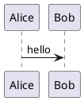

# PlantUML for Zed

Community-oriented PlantUML language extension for Zed. It focuses on reliable
editing support, local diagnostics, and export tasks that work with Zed's
current extension API.

## What works

- Recognizes `.wsd`, `.pu`, `.puml`, `.plantuml`, and `.iuml` files as PlantUML.
- Adds Tree-sitter syntax highlighting through `tree-sitter-plantuml`.
- Adds brackets, indentation, folding, outline, and common snippets.
- Adds a runnable marker at `@startuml`.
- Starts a lightweight PlantUML LSP through the Rust/Wasm Zed extension shell.
- Publishes structural diagnostics for common incomplete diagrams.
- Highlights `plantuml` fenced code blocks in Markdown through Zed's built-in
  Markdown fenced-code injection.
- Provides language-owned Zed tasks from `languages/plantuml/tasks.json`.
- Exports current files and workspaces to PNG, SVG, and PDF.
- Uses `plantuml` from `PATH`, `PLANTUML_JAR`, or an automatically cached pinned
  PlantUML jar.
- Automatically caches PlantUML PDF sidecar libraries for the managed jar when
  exporting PDF.
- Verifies checksums for the pinned PlantUML jar and managed PDF sidecar
  downloads before writing them into the cache.
- Provides a standalone CLI for local exports.

## Install as a dev extension

1. Open Zed.
2. Run `zed: install dev extension`.
3. Select this project directory.

## Export from Zed

Install the extension, open a PlantUML file, then run `task: spawn` and choose
one of the language-provided tasks:

- `PlantUML: export current file to PNG`
- `PlantUML: export current file to PNG and open`
- `PlantUML: export current file to SVG`
- `PlantUML: export current file to PDF`
- `PlantUML: renderer health check`
- `PlantUML: export workspace to PNG`
- `PlantUML: export workspace to SVG`

Generated files go to `out/plantuml`.

The task templates live in `languages/plantuml/tasks.json`, which is how Zed language extensions normally
ship reusable tasks.

`languages/plantuml/tasks.json` is generated from `src/task-commands.mjs`. When
changing export tasks, update the helper module and run:

```bash
npm run generate:tasks
```

Export tasks also honor environment overrides for users who want local control
without editing the generated task file:

- `PLANTUML_ZED_OUTPUT_DIR`
- `PLANTUML_ZED_PLANTUML_VERSION`
- `PLANTUML_ZED_PLANTUML_SHA256`
- `PLANTUML_ZED_PLANTUML_BIN`
- `PLANTUML_ZED_PLANTUML_JAR`
- `PLANTUML_ZED_JAVA`
- `PLANTUML_ZED_GRAPHVIZ_DOT`

Markdown files can use a normal PlantUML code fence:

````markdown

````

Zed's Markdown grammar injects supported languages from fenced code blocks, so
this extension does not replace or override Markdown itself.

## Renderer setup

Zed tasks use local rendering and look for a renderer in this order:

1. `plantuml` from `PATH`
2. `PLANTUML_JAR`
3. automatically downloaded PlantUML `v1.2025.4` jar in the user cache

For automatic rendering, Java and Graphviz must be installed. If `plantuml` and
`PLANTUML_JAR` are both missing, the first export downloads PlantUML from GitHub
to a cache directory and later exports reuse that versioned cached jar:

- macOS default: `~/Library/Caches/zed-plantuml/plantuml-v1.2025.4.jar`
- other platforms:
  `${XDG_CACHE_HOME:-$HOME/.cache}/zed-plantuml/plantuml-v1.2025.4.jar`

PDF export with the managed cached jar also downloads PlantUML's required
Batik/FOP sidecar jars into the same cache directory on first use. Explicit
user jars from `PLANTUML_JAR` or `PLANTUML_ZED_PLANTUML_JAR` are treated as
user-managed and are not modified.

The default managed assets are SHA-256 checked. If you override
`PLANTUML_ZED_PLANTUML_VERSION`, also set `PLANTUML_ZED_PLANTUML_SHA256` to
keep checksum verification for that custom jar.

Use `PlantUML: renderer health check` to verify Java, the cached jar, an
optional `plantuml` command, and Graphviz `dot`.

## Zed settings

The Rust/Wasm extension passes `plantuml-lsp` settings to the bundled local LSP.
Server rendering is intentionally not part of this phase.

```json
{
  "lsp": {
    "plantuml-lsp": {
      "settings": {
        "outputDir": "out/plantuml",
        "defaultFormat": "png",
        "plantumlVersion": "v1.2025.4",
        "plantumlBinary": null,
        "plantumlJar": null,
        "javaBinary": "java",
        "graphvizDot": "dot",
        "autoDownloadJar": true,
        "diagnosticsOnChange": true
      }
    }
  }
}
```

The standalone CLI supports explicit local renderer modes:

- `--renderer auto`
- `--renderer binary --plantuml /path/to/plantuml`
- `--renderer jar --jar /path/to/plantuml.jar`

## CLI usage

```bash
npm run generate:tasks
npm run check:release-package
npm run export:example
node scripts/plantuml-export.mjs --workspace --format png .
node scripts/plantuml-export.mjs --format svg --out-dir out/plantuml examples/sample.puml
node scripts/plantuml-export.mjs --format pdf --out-dir out/plantuml examples/sample.puml
PLANTUML_JAR=/path/to/plantuml.jar node scripts/plantuml-export.mjs examples/sample.puml
```

## Zed API limitation

This extension intentionally uses tasks rather than a custom preview pane. Zed
does not currently expose a stable WebView/custom preview API comparable to VS
Code, so live embedded preview is out of scope until the API exists.
