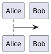

# PlantUML Export

English | [简体中文](README.zh-CN.md)

PlantUML Export is a GitHub-first native PlantUML export toolchain plus a thin
Zed language extension. It provides deterministic local SVG, PNG, and PDF
exports and plugin-managed Zed Code Actions without a Node runtime.

The `v0.1.0-rc.1` GitHub prerelease and its six native helpers are published.
The immutable tag intentionally retains `unpublished` helper metadata; the
current default branch contains the separately reviewed follow-up metadata that
pins those verified assets and enables automatic helper installation.

Distribution is GitHub-only in v0.1. The extension is not listed in the Zed
Gallery: installing it means cloning this repository and choosing **Install Dev
Extension** in Zed. GitHub-only does not provide a one-click Gallery install,
and there is no npm, Homebrew, or Cargo registry package.

## What is included

- Native Rust CLI: `export`, `check`, `health`, `version`, and internal `lsp`.
- Explicit `managed`, `binary`, and `jar` renderer modes; no fallback chain.
- Saved standalone `.puml`, `.plantuml`, `.pu`, `.iuml`, and `.wsd` files.
- Ignore-aware workspace discovery and mirrored output paths.
- Transactional multi-file export with an ownership manifest and rollback.
- Structural edit diagnostics plus cancellable real-path checks on save.
- Zed grammar, queries, snippets, and SVG/PNG/PDF export Code Actions.

Live preview, WebViews, export-on-save, watching, Markdown block export,
telemetry, and source upload are outside v0.1. Server rendering is intentionally not part of this phase.
PlantUML fences such as the following still use Zed's built-in Markdown fenced-code injection
for syntax highlighting; the CLI does not export the fence itself.



## Install this source checkout as a Zed dev extension

Prerequisites are Git, Zed, and `rustup`. Zed compiles a dev extension from its
source checkout, so install the pinned Rust `1.96.0` toolchain and
`wasm32-wasip2` target first. The current default branch contains published
helper metadata, so no native CLI installation or `PATH` setup is required:

```bash
git clone https://github.com/dahuangggg/plantuml-export.git
cd plantuml-export
rustup toolchain install 1.96.0 --profile minimal --component rustfmt --component clippy
rustup target add --toolchain 1.96.0 wasm32-wasip2
```

Clone the current default branch as shown above. Checking out the immutable
`v0.1.0-rc.1` tag instead gives the exact released source candidate, whose
metadata deliberately remains `unpublished`; the default-branch follow-up is
what enables automatic helper download for a GitHub-installed dev extension.

In Zed:

1. Open the command palette and run **Zed: Install Dev Extension**.
2. Select the cloned directory containing `extension.toml`.
3. Open a saved PlantUML file and use the lightning button or `Cmd-.` / `Ctrl-.`.

The checked-in metadata pins all six RC1 helper URLs and SHA-256 values. On LSP
startup the extension ignores `PATH`, downloads the matching helper into Zed's
private extension directory, verifies it before launch, and reuses the verified
copy afterward. A standalone CLI is optional. Users must still clone the
repository and use **Install Dev Extension** because this project is not in the
Zed Gallery.

On the first managed export, check, or LSP startup, the helper downloads the
pinned PlantUML JAR and matching Temurin JRE. Expect approximately 66–78 MiB,
depending on platform. Later uses reuse the installed user cache under the
reuse checks documented in [docs/security.md](docs/security.md); `offline = true`
requires those assets to have been cached already.

## Install the optional CLI from RC1

The [GitHub Releases](https://github.com/dahuangggg/plantuml-export/releases)
page contains `v0.1.0-rc.1`, the six native binaries, and `SHA256SUMS`.

| Platform | Expected asset |
| --- | --- |
| macOS Apple Silicon | `plantuml-export-aarch64-apple-darwin` |
| macOS Intel | `plantuml-export-x86_64-apple-darwin` |
| Ubuntu 24.04 ARM64 (GNU) | `plantuml-export-aarch64-unknown-linux-gnu` |
| Ubuntu 24.04 x86-64 (GNU) | `plantuml-export-x86_64-unknown-linux-gnu` |
| Windows ARM64 | `plantuml-export-aarch64-pc-windows-msvc.exe` |
| Windows x86-64 | `plantuml-export-x86_64-pc-windows-msvc.exe` |

RC1's Linux binaries are built and smoke-tested on Ubuntu 24.04 with glibc;
other GNU/Linux distributions may work but are not an RC1 compatibility
guarantee. With GitHub CLI installed, first confirm that its immutable-release
verification commands exist, then set `ASSET` to the exact table entry for the
current machine:

```bash
ASSET=plantuml-export-x86_64-unknown-linux-gnu
gh release verify --help >/dev/null
gh release verify-asset --help >/dev/null
gh release download v0.1.0-rc.1 --repo dahuangggg/plantuml-export --pattern SHA256SUMS
gh release download v0.1.0-rc.1 --repo dahuangggg/plantuml-export --pattern "$ASSET"
gh release verify v0.1.0-rc.1 --repo dahuangggg/plantuml-export
gh release verify-asset v0.1.0-rc.1 SHA256SUMS --repo dahuangggg/plantuml-export
gh release verify-asset v0.1.0-rc.1 "$ASSET" --repo dahuangggg/plantuml-export
gh attestation verify SHA256SUMS --repo dahuangggg/plantuml-export
gh attestation verify "$ASSET" --repo dahuangggg/plantuml-export
grep "  $ASSET$" SHA256SUMS | sha256sum --check -
mkdir -p ~/.local/bin
install -m 0755 "$ASSET" ~/.local/bin/plantuml-export
plantuml-export version --json
```

On macOS, replace the checksum command with
`grep "  $ASSET$" SHA256SUMS | shasum -a 256 --check`. On Windows, compare
`Get-FileHash -Algorithm SHA256 <asset>` with the matching `SHA256SUMS` line,
then place the `.exe` in a directory on `PATH`. The standalone CLI remains
optional and is not consulted by the current published-metadata Zed extension.

## CLI

```text
plantuml-export export [INPUTS...] [--workspace] [--format svg|png|pdf]
                       [--out-dir PATH] [--layout graphviz|smetana]
                       [--keep-going] [--require-input] [--json]
plantuml-export check [INPUTS...] [--workspace] [--require-input] [--json]
plantuml-export health [--json]
plantuml-export version [--json]
```

`--root PATH` and `--config PATH` are global. Inputs always use their saved
disk state. With no input, `export` and `check` are successful no-ops unless
`--require-input` is present.

Exit codes are stable:

- `0`: success;
- `1`: expected source or operation failure, including partial
  `--keep-going` results;
- `2`: invalid usage/configuration or an unavailable environment dependency.

`--json` emits one schema-versioned document on stdout. A partial export has
`ok: false`, exit `1`, and still includes every success and failure in `data`.

Examples:

```bash
plantuml-export export examples/sample.puml
plantuml-export export --workspace --format png
plantuml-export export --workspace --keep-going --json
plantuml-export check --workspace --require-input
plantuml-export health --json
```

Outputs default to `out` and mirror source paths. For example,
`docs/auth/login.puml` becomes `out/docs/auth/login.svg`. The output tree
contains only final SVG, PNG, and PDF artifacts; export bookkeeping never
appears there. The internal manifest uses `schemaVersion = 2` and stores each
source's SVG, PNG, and PDF state independently under
`inputs[source].formats[format]`. Every output entry is a `{ path, sha256 }`
record alongside that format's exact tool, renderer, and environment
provenance. Exporting PNG after SVG therefore keeps both formats. Re-exporting
one format replaces only that format and removes only its stale multi-page
outputs; other formats and untouched sources remain unchanged.

## Configuration

There is one portable `plantuml-export.toml` at the worktree root:

```toml
renderer = "managed"
format = "svg"
outDir = "out"
layout = "smetana"
includePaths = ["docs/includes"]
remoteIncludes = "public"
include = ["docs/**/*.puml"]
exclude = ["docs/generated/**"]
embedSourceMetadata = false
```

Configuration starts with built-in defaults, then applies user config, project
config, and explicit CLI overrides. Ordinary scalar settings therefore follow
CLI > project > user > defaults, while `includePaths` are additive. Project
`outDir` and `includePaths` must be portable relative paths and cannot contain
`..`. Project files may select a renderer mode or layout, but cannot supply
executable, JAR, Java, Graphviz, trusted-origin, or download paths. Explicit
`binary`, `jar`, or Graphviz choices therefore use only machine-owner paths
already provided by user config or CLI and fail if those tools are unavailable.

Remote includes use a monotonic policy ordered from `public` to `allowlist` to
`disabled`. `public` is the zero-configuration default. A project can tighten
the user's policy but cannot widen it; likewise, project `offline = true` can
enable offline mode, while `offline = false` cannot undo a user-level offline
policy. Offline mode always disables remote includes.

Machine-local settings belong in the user config:

- macOS/Linux: `${XDG_CONFIG_HOME:-~/.config}/plantuml-export/config.toml`
- Windows: `%APPDATA%\plantuml-export\config.toml`

```toml
# Used only by renderer = "jar".
javaPath = "/path/to/java"
binaryPath = "/path/to/plantuml"
jarPath = "/path/to/plantuml.jar"
graphvizPath = "/path/to/dot"
offline = false

# Optional remote-include controls.
remoteIncludes = "public" # public | allowlist | disabled
# Trusted origins are read only from this user config.
allowedRemoteUrls = [
  "https://example.com/"
]
```

An absolute CLI/user `includePath` is an explicit extra local read root.
Relative include paths remain confined to the worktree. Every
`allowedRemoteUrls` entry must be an HTTP(S) origin: scheme, host, and optional
port only. A non-root path, credentials, query, fragment, or `;` is rejected;
the canonical value ends in `/`. An entry authorizes every path at that origin.
Because this user-config setting is a global machine authorization applied to
every worktree, add an origin only when every repository opened on the machine
may fetch from it. Project configuration and Zed settings cannot add origins.

## Renderer policy

`managed` is the default. It pins official PlantUML `1.2026.6`, Eclipse
Temurin JRE `21.0.11+10`, and every archive checksum for the six supported
OS/architecture pairs. The generic PlantUML JAR SHA-256 is:

```text
89948f14c93756c7a3fb7b69078ff37e8489fd79dd430c582b931e2f65358690
```

The JAR and matching JRE archive are downloaded from fixed official GitHub
release URLs only when an explicit export, check, or `plantuml-export lsp`
startup needs them. Downloads are size-limited, guarded by crash-released
operating-system locks, checksum-verified, safely extracted in staging, and
atomically installed in the user cache. A first managed use downloads about
66–78 MiB, depending on platform. `offline = true` forbids both managed asset
downloads and remote includes.

- Managed SVG, PNG, and PDF require no user-installed Java.
- Smetana is the default layout and requires no user-installed Graphviz.
- Explicit `layout = "graphviz"` requires `dot`; its executable is resolved to
  an absolute path and passed to PlantUML explicitly.
- `binary` requires `binaryPath` or `--plantuml`.
- `jar` requires `jarPath` or `--jar` plus the Java selected by `javaPath` or
  `--java` (Java 17+ for SVG/PNG and Java 21+ for PDF).

See the official [PlantUML command-line](https://plantuml.com/command-line) and
[security](https://plantuml.com/security) documentation for the underlying
renderer behavior.

## Security and privacy

Every render clears inherited PlantUML security, include, and URL-allowlist
variables plus the JVM aggregate option variables `JAVA_TOOL_OPTIONS`,
`JDK_JAVA_OPTIONS`, and `_JAVA_OPTIONS` before applying the resolved policy,
preventing the parent environment from overriding it. Local reads remain
limited to the worktree, source directory, and explicit include roots.

- `public` (default) applies PlantUML `INTERNET`, so ordinary public HTTP(S)
  includes work without configuration. Its private-address, raw-address, and
  port checks are implemented upstream by PlantUML. They reduce SSRF exposure,
  but they are not a strong network sandbox and do not guarantee absolute
  isolation against DNS rebinding or changes in upstream behavior.
- `allowlist` applies PlantUML `ALLOWLIST` and permits only origins declared by
  the machine owner in the user config. Each declaration authorizes every path
  at that origin for every worktree.
- `disabled`, and every invocation with `offline = true`, applies `ALLOWLIST`
  without an authorized remote origin.

Because project configuration and Zed worktree settings merge monotonically,
an untrusted worktree can restrict network access but cannot grant itself
access that a stricter user policy denied. Source metadata is suppressed unless
`embedSourceMetadata = true`. There is no telemetry or remote renderer. A
remote include host can observe the requested URL, client address, and ordinary
HTTP metadata; the tool does not upload the diagram as a remote render request.

The network surfaces are:

1. public or user-allowlisted remote includes requested by a diagram;
2. fixed Temurin JRE and PlantUML JAR downloads after explicit managed use;
3. the checksum-pinned native helper download by Zed.

See [docs/security.md](docs/security.md) for the trust and failure model.

## Zed integration

Follow [the source-checkout installation](#install-this-source-checkout-as-a-zed-dev-extension)
above to use the language assets. GitHub-only distribution still uses Zed's dev
extension flow; it is not a Zed Gallery installation. The registered language
server ID is `plantuml-lsp`.

Zed exposes the safe worktree-level controls through
`lsp.plantuml-lsp.initialization_options`:

```json
{
  "lsp": {
    "plantuml-lsp": {
      "initialization_options": {
        "includePaths": ["docs/includes"],
        "remoteIncludes": "public"
      }
    }
  }
}
```

Only `includePaths` and `remoteIncludes` are accepted there. Include paths are
added to the resolved config, and the remote policy can only become stricter.
`allowedRemoteUrls`, `offline`, and machine executable paths belong in the user
config and are rejected from Zed worktree settings.

For LSP startup the Wasm adapter reads the checked-in helper metadata first.
Published metadata always selects and verifies the exact matching helper in
Zed's private extension working directory, downloading it only when the cached
file is missing or its SHA-256 does not match. It ignores any standalone CLI on
`PATH`. Only an unpublished source checkout calls
`worktree.which("plantuml-export")` as a development bootstrap. The managed
helper starts as `plantuml-export lsp` without a user-installed CLI.

With a saved PlantUML file open, use the inline lightning button or `Cmd-.` /
`Ctrl-.` and select **Export PlantUML to SVG**, **PNG**, or **PDF**. Zed sends
the selected Code Action back to the already-running helper through
`workspace/executeCommand`; that same native helper/LSP process performs the
export. It never looks up a second `plantuml-export` command on `PATH`.

The native LSP helper provides export actions and diagnostics:

- export actions reject unsaved buffers instead of silently exporting stale
  disk contents;
- exports run on a serial worker while the LSP remains responsive;
- it finishes the LSP handshake first, then prepares the selected renderer so
  the first managed JRE/JAR download cannot be mistaken for a startup timeout;
- managed startup health-checks its pinned Java 21 runtime and SVG/Smetana;
  Graphviz is not required;
- edits receive an in-memory structural pass after about 250 ms;
- saves use the real file path and a 10-second PlantUML syntax check;
- a newer edit, close, or shutdown cancels an older save process;
- startup renderer/Java failures exit with environment status on stderr after
  the handshake, never as a fake source range.

## Export safety

Workspace discovery respects `.gitignore`, `.ignore`, global Git ignores, and
configured include/exclude globs. It never follows directory symlinks or enters
`.git`, the output directory, or the managed cache.

Each input renders into isolated staging. All outputs must be regular,
non-empty files matching the requested SVG/PNG/PDF type. The session rejects
collisions and unmanaged existing targets before replacing anything. The
manifest is the cleanup authority: only files previously owned by the same
source and format, whose bytes still match the manifest's SHA-256, can be
replaced or removed. Re-exporting SVG, for example, cannot delete or relabel
that source's PNG or PDF outputs. A stale manifest therefore cannot overwrite a
user-created replacement after the output directory is recreated. Default
batches leave the previous outputs and manifest unchanged on any input failure;
`--keep-going` commits independent successes and reports all failures.
The commit boundary rechecks moved backups and installs final files with an
atomic no-clobber hard link, so a file created concurrently after planning is
also preserved.
Per-source, per-format provenance is updated only for those committed
successes, so an untouched format never inherits the current invocation's
renderer or environment metadata. An operating-system lock serializes writers
to one output directory. A synced journal records expected file hashes and
backups before mutation, so the next export can recover an interrupted commit
without deleting a file that changed after the interruption. The ownership
manifest, lock, render staging, journal, and backups live in a private platform
application-state directory keyed by the workspace/output pair:

- macOS: `~/Library/Application Support/plantuml-export/exports/<workspace-hash>`
- Windows: `%LOCALAPPDATA%\plantuml-export\state\exports\<workspace-hash>`
- Linux: `${XDG_STATE_HOME:-~/.local/state}/plantuml-export/exports/<workspace-hash>`

Consequently, the configured output directory contains only final exported
artifacts, including while transaction bookkeeping is retained for recovery.
The output and application-state directories must be on the same filesystem so
the rollback transaction can use atomic renames; a cross-volume configuration
fails before rendering or mutating outputs.

## Troubleshooting

For standalone CLI troubleshooting, start with:

```bash
plantuml-export health --json
plantuml-export check path/to/diagram.puml --json
```

- `managed ... offline`: run once online or disable offline mode so the pinned
  JRE and JAR can be cached; offline mode also blocks every remote include.
- checksum mismatch: remove only the named managed asset and retry; never
  bypass checksum verification.
- Java too old applies only to explicit `jar` mode; managed mode owns Java 21.
- Graphviz missing applies only to explicit `layout = "graphviz"`; the default
  Smetana layout does not need `dot`.
- invalid `remoteIncludes`: use the string `public`, `allowlist`, or `disabled`;
  boolean values are not supported.
- remote include blocked: `public` accepts ordinary public URLs, while a private
  or unusual endpoint needs its exact HTTP(S) origin in the user config;
  `allowlist` requires an authorized origin for every remote URL. Origins cannot
  contain a non-root path and authorize every path on that origin globally.
  Project and Zed settings cannot add them.
- export action missing: open a PlantUML file and restart its language server.
- document not saved: save the current file, then run the Code Action again.
- ownership conflict: move the unmanaged target or choose another `outDir`;
  the tool will not overwrite it.

## Development and release gates

```bash
cargo fmt --all -- --check
cargo test --locked --workspace --all-targets
cargo clippy --locked --workspace --all-targets -- -D warnings
cargo build --locked --target wasm32-wasip2 --target-dir target
cargo install cargo-audit --version 0.22.2 --locked
cargo audit --deny warnings --file Cargo.lock
npm test
npm run check:release-package
```

Node is used only for repository/static release checks and native-helper
metadata generation. It is not a product runtime.

CI installs `cargo-audit 0.22.2` and runs Gitleaks `8.30.1` against complete Git
history. A release candidate must reproduce both scans locally before push.
Suspected vulnerabilities should be reported privately under
[SECURITY.md](SECURITY.md), not through a public issue.

The GitHub workflow builds six host-native binaries, publishes `SHA256SUMS`,
and emits GitHub artifact attestations. No candidate push or tag is performed
without separate explicit approval. See
[docs/release-checklist.md](docs/release-checklist.md), [CHANGELOG.md](CHANGELOG.md),
and the prepared [RC1 release body](release/notes-v0.1.0-rc.1.md).

## License

Project code is [MIT](LICENSE). Managed mode downloads
[Eclipse Temurin](https://adoptium.net/docs/faq) under GPL-2.0 with the
Classpath Exception and the official PlantUML distribution under its
[published license terms](https://plantuml.com/download); their bundled notices
and legal files are preserved in the managed cache.
