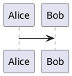

# PlantUML Export

[English](README.md) | 简体中文

PlantUML Export 是一个以 GitHub 为首要发布渠道的原生 PlantUML 导出工具链，
并附带一个轻量的 Zed 语言扩展。它无需 Node 运行时，即可提供确定性的本地
SVG、PNG 和 PDF 导出，以及由插件管理的 Zed Code Action。

`v0.1.0-rc.1` GitHub 预发布及其六个平台原生 helper 已经发布。不可变 tag 中的
helper metadata 刻意保持为 `unpublished`；当前默认分支包含经过单独审核的后续
metadata，用来固定这些已验证资产并启用 helper 自动安装。

v0.1 只通过 GitHub 分发，尚未上架 Zed Gallery。“安装扩展”是指 clone 此仓库，
然后在 Zed 中选择 **Install Dev Extension**；GitHub-only 不等于 Gallery 一键
安装，也不提供 npm、Homebrew 或 Cargo registry 包。

## 包含内容

- 原生 Rust CLI：`export`、`check`、`health`、`version` 以及内部命令 `lsp`。
- 显式的 `managed`、`binary` 和 `jar` 渲染器模式；不存在回退链。
- 已保存的独立 `.puml`、`.plantuml`、`.pu`、`.iuml` 和 `.wsd` 文件。
- 遵循忽略规则的工作区发现和镜像输出路径。
- 带所有权清单和回滚能力的事务式多文件导出。
- 结构编辑诊断，以及保存时可取消的真实路径检查。
- Zed grammar、query、snippet，以及 SVG/PNG/PDF 导出 Code Action。

实时预览、WebView、保存时导出、文件监视、Markdown 代码块导出、遥测和
源文件上传不在 v0.1 范围内。此阶段也有意不包含服务器渲染。如下所示的
PlantUML fence 仍使用 Zed 内置的 Markdown 围栏代码注入进行语法高亮；
CLI 本身不会导出该 fence。



## 把当前源码安装为 Zed 开发扩展

前置要求是 Git、Zed 和 `rustup`。Zed 会从源码编译开发扩展，因此要先安装
项目固定的 Rust `1.96.0` 工具链和 `wasm32-wasip2` target。当前默认分支已经
包含 published helper metadata，因此不需要安装原生 CLI，也不需要配置 CLI
`PATH`：

```bash
git clone https://github.com/dahuangggg/plantuml-export.git
cd plantuml-export
rustup toolchain install 1.96.0 --profile minimal --component rustfmt --component clippy
rustup target add --toolchain 1.96.0 wasm32-wasip2
```

请按上面的命令 clone 当前默认分支。如果改为 checkout 不可变的
`v0.1.0-rc.1` tag，得到的是完全一致的发布候选源码，其中 metadata 按设计仍为
`unpublished`；正是默认分支的后续提交为 GitHub 安装的开发扩展启用了自动下载。

在 Zed 中：

1. 打开命令面板，运行 **Zed: Install Dev Extension**。
2. 选择包含 `extension.toml` 的 clone 目录。
3. 打开一个已保存的 PlantUML 文件，通过闪电按钮或 `Cmd-.` / `Ctrl-.` 导出。

已提交的 metadata 固定了 RC1 六个平台 helper 的 URL 和 SHA-256。启动 LSP 时，
扩展会忽略 `PATH`，把匹配平台的 helper 下载到 Zed 私有扩展目录，验证后启动，
之后复用已验证副本。独立 CLI 只是可选工具。由于项目没有上架 Zed Gallery，
用户仍需 clone 仓库并使用 **Install Dev Extension**。

首次 managed 导出、检查或启动 LSP 时，helper 会下载固定版本的 PlantUML JAR
和匹配的 Temurin JRE；按平台预计约 66–78 MiB。之后会按照
[docs/security.md](docs/security.md) 记录的复用检查使用已安装的用户缓存；使用
`offline = true` 前必须先完成缓存。

## 从 RC1 安装可选 CLI

[GitHub Releases](https://github.com/dahuangggg/plantuml-export/releases) 页面
已经包含 `v0.1.0-rc.1`、六个平台原生二进制和 `SHA256SUMS`。

| 平台 | 预期资产 |
| --- | --- |
| macOS Apple Silicon | `plantuml-export-aarch64-apple-darwin` |
| macOS Intel | `plantuml-export-x86_64-apple-darwin` |
| Ubuntu 24.04 ARM64（GNU） | `plantuml-export-aarch64-unknown-linux-gnu` |
| Ubuntu 24.04 x86-64（GNU） | `plantuml-export-x86_64-unknown-linux-gnu` |
| Windows ARM64 | `plantuml-export-aarch64-pc-windows-msvc.exe` |
| Windows x86-64 | `plantuml-export-x86_64-pc-windows-msvc.exe` |

RC1 Linux 二进制在 Ubuntu 24.04 + glibc 上构建并完成真实冒烟；其他 GNU/Linux
发行版可能可用，但不属于 RC1 兼容性承诺。安装 GitHub CLI 后，先确认它支持
不可变 Release 验证命令，再将 `ASSET` 设为当前机器对应的准确资产名：

```bash
ASSET=plantuml-export-x86_64-unknown-linux-gnu
gh release verify --help >/dev/null
gh release verify-asset --help >/dev/null
gh release download v0.1.0-rc.1 --repo dahuangggg/plantuml-export --pattern SHA256SUMS
gh release download v0.1.0-rc.1 --repo dahuangggg/plantuml-export --pattern "$ASSET"
gh release verify v0.1.0-rc.1 --repo dahuangggg/plantuml-export
gh release verify-asset v0.1.0-rc.1 SHA256SUMS --repo dahuangggg/plantuml-export
gh release verify-asset v0.1.0-rc.1 "$ASSET" --repo dahuangggg/plantuml-export
gh attestation verify SHA256SUMS --repo dahuangggg/plantuml-export
gh attestation verify "$ASSET" --repo dahuangggg/plantuml-export
grep "  $ASSET$" SHA256SUMS | sha256sum --check -
mkdir -p ~/.local/bin
install -m 0755 "$ASSET" ~/.local/bin/plantuml-export
plantuml-export version --json
```

macOS 请把 checksum 命令换成
`grep "  $ASSET$" SHA256SUMS | shasum -a 256 --check`。Windows 请用
`Get-FileHash -Algorithm SHA256 <asset>` 与 `SHA256SUMS` 中对应行比较，再把
`.exe` 放入 `PATH`。独立 CLI 始终是可选的，当前使用 published metadata 的
Zed 扩展不会查找它。

## CLI

```text
plantuml-export export [INPUTS...] [--workspace] [--format svg|png|pdf]
                       [--out-dir PATH] [--layout graphviz|smetana]
                       [--keep-going] [--require-input] [--json]
plantuml-export check [INPUTS...] [--workspace] [--require-input] [--json]
plantuml-export health [--json]
plantuml-export version [--json]
```

`--root PATH` 和 `--config PATH` 是全局选项。输入始终使用已保存到磁盘的
状态。未提供输入时，`export` 和 `check` 会成功地空操作，除非指定了
`--require-input`。

退出码保持稳定：

- `0`：成功；
- `1`：预期的源文件或操作失败，包括部分成功的 `--keep-going` 结果；
- `2`：无效的用法/配置，或环境依赖不可用。

`--json` 会在 stdout 输出一个带 schema 版本的文档。部分导出会返回
`ok: false`、退出码 `1`，并仍在 `data` 中包含每项成功和失败结果。

示例：

```bash
plantuml-export export examples/sample.puml
plantuml-export export --workspace --format png
plantuml-export export --workspace --keep-going --json
plantuml-export check --workspace --require-input
plantuml-export health --json
```

输出默认为 `out`，并镜像源文件路径。例如，`docs/auth/login.puml` 会变为
`out/docs/auth/login.svg`。输出目录中只会出现最终的 SVG、PNG 和 PDF 产物，
不会出现导出过程的内部状态。内部 manifest 使用 `schemaVersion = 2`，并在
`inputs[source].formats[format]` 下分别保存同一源文件的 SVG、PNG 和 PDF
状态。每个输出项都是 `{ path, sha256 }` 记录，同时保存该格式确切的工具、
渲染器和环境来源信息。因此先导出 SVG 再导出 PNG 时会同时保留两种格式；
重新导出某一格式只替换该格式，并只清理它自己已过期的多页输出，其他格式和
未触及的源文件保持不变。

## 配置

工作树根目录中只有一个可移植的 `plantuml-export.toml`：

```toml
renderer = "managed"
format = "svg"
outDir = "out"
layout = "smetana"
includePaths = ["docs/includes"]
remoteIncludes = "public"
include = ["docs/**/*.puml"]
exclude = ["docs/generated/**"]
embedSourceMetadata = false
```

配置从内置默认值开始，依次应用用户配置、项目配置和显式 CLI 覆盖。
因此普通标量设置的优先级为 CLI > 项目 > 用户 > 默认值，而
`includePaths` 会追加合并。项目中的 `outDir` 和 `includePaths` 必须是
可移植的相对路径，且不能包含 `..`。项目文件可以选择 renderer 模式和 layout，
但不能提供可执行文件、JAR、Java、Graphviz、受信任远程 origin 或下载路径。
因此显式 `binary`、`jar` 或 Graphviz 只能使用用户配置/CLI 已授权的机器路径；
这些可信工具不存在时会直接失败。

远程 include 使用从 `public` 到 `allowlist` 再到 `disabled` 的单调收紧
策略。`public` 是零配置默认值。项目可以收紧用户策略，但不能放宽；
同样，项目中的 `offline = true` 可以开启离线模式，但 `offline = false`
不能撤销用户层的离线策略。离线模式始终禁止远程 include。

机器本地设置应放在用户配置中：

- macOS/Linux：`${XDG_CONFIG_HOME:-~/.config}/plantuml-export/config.toml`
- Windows：`%APPDATA%\plantuml-export\config.toml`

```toml
# 仅供 renderer = "jar" 使用。
javaPath = "/path/to/java"
binaryPath = "/path/to/plantuml"
jarPath = "/path/to/plantuml.jar"
graphvizPath = "/path/to/dot"
offline = false

# 可选的远程 include 控制。
remoteIncludes = "public" # public | allowlist | disabled
# 受信任的 origin 仅从这份用户配置读取。
allowedRemoteUrls = [
  "https://example.com/"
]
```

CLI/用户配置中的绝对 `includePath` 是显式的额外本地读取根目录。相对
include 路径仍被限制在工作树内。每个 `allowedRemoteUrls` 条目都必须是
HTTP(S) origin，也就是只能包含 scheme、host 和可选端口。非根路径、凭据、
query、fragment 或 `;` 都会被拒绝，规范化后的值以 `/` 结尾。一个条目会
授权该 origin 下的所有路径。这是用户配置中的全局机器授权，会应用到所有
工作区；只有当机器上打开的每个仓库都可以访问该 origin 时才应添加。项目
配置和 Zed 设置都不能新增 origin。

## 渲染器策略

`managed` 是默认模式。它固定使用官方 PlantUML `1.2026.6`、Eclipse
Temurin JRE `21.0.11+10`，以及六个受支持操作系统/架构组合各自的归档校验和。
通用 PlantUML JAR 的 SHA-256 为：

```text
89948f14c93756c7a3fb7b69078ff37e8489fd79dd430c582b931e2f65358690
```

只有在显式的导出、检查或 `plantuml-export lsp` 启动需要时，才会从固定的
官方 GitHub Release URL 下载 JAR 和匹配的 JRE 归档。下载有大小限制，并受
崩溃后自动释放的操作系统锁保护；校验和验证通过后，会在 staging 中安全解包，
再以原子方式安装到用户缓存。首次 managed 使用会按平台自动下载约 66–78 MiB。
`offline = true` 会同时禁止 managed 资产下载和远程 include。

- Managed SVG、PNG 和 PDF 不要求用户安装 Java。
- Smetana 是默认布局，不要求用户安装 Graphviz。
- 显式 `layout = "graphviz"` 时才要求 `dot`；选定的可执行文件会解析为绝对
  路径，并显式传给 PlantUML。
- `binary` 要求 `binaryPath` 或 `--plantuml`。
- `jar` 要求 `jarPath` 或 `--jar`，并使用 `javaPath` 或 `--java` 选定的 Java
  （SVG/PNG 要求 17+，PDF 要求 21+）。

底层渲染器行为请参阅 PlantUML 官方的
[命令行](https://plantuml.com/command-line)和
[安全](https://plantuml.com/security)文档。

## 安全与隐私

每次渲染都会先清除继承的 PlantUML security、include 和 URL allowlist
环境变量，以及 JVM 聚合选项变量 `JAVA_TOOL_OPTIONS`、`JDK_JAVA_OPTIONS` 和
`_JAVA_OPTIONS`，再应用解析后的策略，防止父进程环境覆盖安全策略。本地读取
范围始终仅限工作树、源文件目录和显式 include 根目录。

- `public`（默认）应用 PlantUML `INTERNET`，因此普通公网 HTTP(S) include
  无需配置即可使用。私有地址、原始地址和端口检查由 PlantUML 上游实现；
  它们会降低 SSRF 风险，但不是强网络沙箱，也不能绝对防御 DNS rebinding
  或上游行为变化带来的风险。
- `allowlist` 应用 PlantUML `ALLOWLIST`，仅允许机器所有者在用户配置中
  声明的 origin。每个声明会为所有工作区授权该 origin 下的全部路径。
- `disabled` 以及所有设置了 `offline = true` 的调用都使用不带远程
  origin 授权的 `ALLOWLIST`。

由于项目配置和 Zed 工作树设置都使用单调收紧的合并方式，不受信任的
工作树可以限制网络访问，但不能绕过用户已经设置的更严格策略。除非
`embedSourceMetadata = true`，否则不会嵌入源文件元数据。本工具没有遥测
或远程渲染器。远程 include 主机可以看到请求 URL、客户端地址和普通 HTTP
元数据；本工具不会把整个图表作为远程渲染请求上传。

网络访问面包括：

1. 图表请求的公网或用户 allowlist 远程 include；
2. 显式 managed 使用触发的固定 Temurin JRE 和 PlantUML JAR 下载；
3. Zed 下载的校验和固定原生 helper。

信任与失败模型请参阅 [docs/security.md](docs/security.md)。

## Zed 集成

按照上方的[源码 checkout 安装步骤](#把当前源码安装为-zed-开发扩展)即可使用
语言资产。GitHub-only 分发仍然使用 Zed 开发扩展流程，并不是 Zed Gallery
安装。注册的语言服务器 ID 是 `plantuml-lsp`。

Zed 通过 `lsp.plantuml-lsp.initialization_options` 暴露安全的工作树级控制：

```json
{
  "lsp": {
    "plantuml-lsp": {
      "initialization_options": {
        "includePaths": ["docs/includes"],
        "remoteIncludes": "public"
      }
    }
  }
}
```

这里只接受 `includePaths` 和 `remoteIncludes`。include 路径会追加到已解析的
配置，远程策略只能变得更严格。`allowedRemoteUrls`、`offline` 和机器可执行
文件路径属于用户配置，如果出现在 Zed 工作树设置中会被拒绝。

启动 LSP 时，Wasm 适配器会先读取已提交的 helper 元数据。元数据为
`published` 时，它始终选择并验证 Zed 私有扩展工作目录中与当前平台完全匹配的
helper；仅当缓存缺失或 SHA-256 不匹配时才下载，同时忽略 `PATH` 中的独立 CLI。
只有元数据仍为
`unpublished` 的源码开发版本才调用 `worktree.which("plantuml-export")` 作为
开发 bootstrap。受管 helper 随后以 `plantuml-export lsp` 启动，无需用户安装
CLI。

打开已保存的 PlantUML 文件后，点击行内闪电按钮，或按 `Cmd-.` / `Ctrl-.`，
选择 **Export PlantUML to SVG**、**PNG** 或 **PDF**。Zed 会通过
`workspace/executeCommand` 将 Code Action 发送回已经运行的 helper；导出由
同一个原生 helper/LSP 进程完成，不会再从 `PATH` 查找第二个 CLI。

原生 LSP helper 同时提供导出动作和诊断：

- 未保存的 buffer 会被明确拒绝，避免静默导出磁盘上的旧内容；
- 导出在串行 worker 中执行，LSP 主循环仍可继续响应；
- 它先完成 LSP 握手，再准备选定的渲染器，避免首次下载 managed JRE/JAR 时
  被编辑器误判为启动超时；
- managed 启动会检查固定的 Java 21 运行时及 SVG/Smetana；不要求 Graphviz；
- 编辑后约 250 ms 执行一次内存中的结构检查；
- 保存时使用真实文件路径，执行最长 10 秒的 PlantUML 语法检查；
- 较新的编辑、关闭或 shutdown 会取消较早的保存进程；
- 渲染器/Java 启动失败时，会在握手后将环境状态写到 stderr 并退出，绝不会
  伪装成源文件范围错误。

## 导出安全性

工作区发现遵循 `.gitignore`、`.ignore`、Git 全局忽略规则以及配置的
include/exclude glob。它绝不会跟随目录符号链接，也不会进入 `.git`、输出
目录或 managed 缓存。

每个输入都会渲染到隔离的 staging 区域。所有输出都必须是符合请求的
SVG/PNG/PDF 类型的非空普通文件。替换任何内容之前，会话会拒绝冲突和不受
管理的现有目标。manifest 是清理操作的权威依据：只有先前由同一源文件拥有、
属于同一格式且文件内容仍与 manifest 中 SHA-256 一致的文件，才能被替换或
删除。例如，重新导出 SVG 不能删除或重写该源文件的 PNG 或 PDF 所有权；即使
输出目录被重建，过期 manifest 也不能覆盖用户新建的同名文件。默认批处理在
任一输入失败时，会保持之前的输出和 manifest 不变；`--keep-going` 会提交互相
独立的成功结果，并报告全部失败。每个“源文件 + 格式”的来源信息仅随对应成功
提交而更新。提交边界还会再次校验已移动的备份，并以原子“不覆盖”硬链接安装
最终文件，因此规划完成后并发出现的同名用户文件也会被保留。未触及的
格式绝不会继承当前调用的渲染器或环境元数据。操作系统锁会串行化同一输出
目录的写入者。同步的 journal 会在变更前记录预期文件哈希和备份，使下一次
导出可以恢复中断的提交，同时不会删除中断后已发生变化的文件。

所有权 manifest、锁、渲染 staging、journal 和备份都位于按“工作区 + 输出
目录”生成哈希的私有平台应用状态目录：

- macOS：`~/Library/Application Support/plantuml-export/exports/<workspace-hash>`
- Windows：`%LOCALAPPDATA%\plantuml-export\state\exports\<workspace-hash>`
- Linux：`${XDG_STATE_HOME:-~/.local/state}/plantuml-export/exports/<workspace-hash>`

因此，即使保留了恢复事务所需的内部状态，配置的输出目录中也只会出现最终
导出产物。输出目录与应用状态目录必须位于同一文件系统，以便回滚事务使用
原子重命名；跨磁盘卷的配置会在渲染或修改输出前明确失败。

## 故障排查

排查独立 CLI 时，请先运行：

```bash
plantuml-export health --json
plantuml-export check path/to/diagram.puml --json
```

- `managed ... offline`：联网运行一次，或关闭 offline 模式，让固定的 JRE 和
  JAR 完成缓存；offline 模式也会阻止所有远程 include。
- 校验和不匹配：只删除提示中指定的 managed 资产后重试；绝不要绕过校验和。
- Java 版本过低只会影响显式 `jar` 模式；managed 模式自行管理 Java 21。
- 缺少 Graphviz 只会影响显式 `layout = "graphviz"`；默认 Smetana 不需要 `dot`。
- `remoteIncludes` 无效：请使用字符串 `public`、`allowlist` 或 `disabled`；
  不支持布尔值。
- 远程 include 被阻止：`public` 直接接受普通公网 URL，私有或特殊端点需要
  把其确切 HTTP(S) origin 加入用户配置；`allowlist` 要求每个远程 URL 都有
  已授权 origin。origin 不能包含非根路径，并会在机器上全局授权该 origin 的
  所有路径。项目和 Zed 设置不能新增 origin。
- 找不到导出动作：打开 PlantUML 文件并重启对应的 language server。
- 文档未保存：先保存当前文件，再重新运行 Code Action。
- 所有权冲突：移动不受管理的目标，或选择其他 `outDir`；工具不会覆盖它。

## 开发与发布门槛

```bash
cargo fmt --all -- --check
cargo test --locked --workspace --all-targets
cargo clippy --locked --workspace --all-targets -- -D warnings
cargo build --locked --target wasm32-wasip2 --target-dir target
cargo install cargo-audit --version 0.22.2 --locked
cargo audit --deny warnings --file Cargo.lock
npm test
npm run check:release-package
```

Node 仅用于仓库/静态发布检查和原生 helper 元数据生成。它不是产品运行时。

CI 会安装 `cargo-audit 0.22.2`，并使用 Gitleaks `8.30.1` 扫描完整 Git 历史。
候选版本在推送前必须在本机复现这两项扫描。
疑似漏洞请按 [SECURITY.md](SECURITY.md) 私下报告，不要提交公开 Issue。

GitHub 工作流会构建六个主机原生二进制文件、发布 `SHA256SUMS`，并生成
GitHub artifact attestation。未经单独明确批准，不会推送候选版本或 tag。
参阅 [docs/release-checklist.md](docs/release-checklist.md)、
[CHANGELOG.md](CHANGELOG.md) 和 [RC1 发布正文](release/notes-v0.1.0-rc.1.md)。

## 许可证

项目代码采用 [MIT](LICENSE)。managed 模式下载的
[Eclipse Temurin](https://adoptium.net/docs/faq) 采用带 Classpath Exception
的 GPL-2.0；官方 PlantUML 发行物遵循其
[发布的许可证条款](https://plantuml.com/download)。两者随附的 notice 和
legal 文件会保留在 managed 缓存中。
